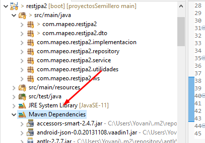
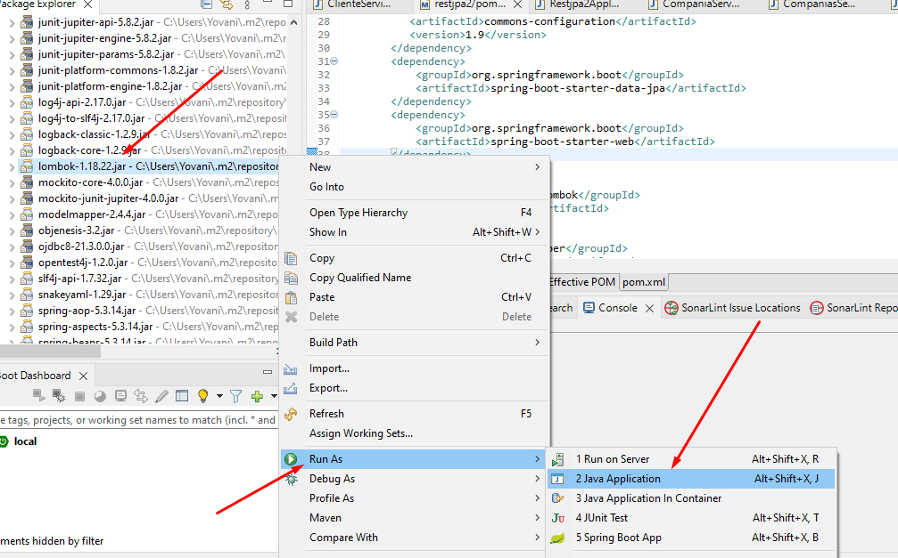
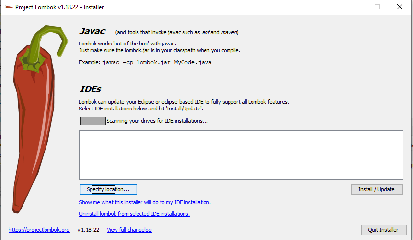
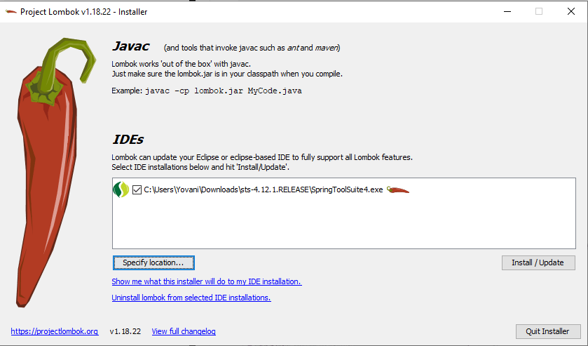
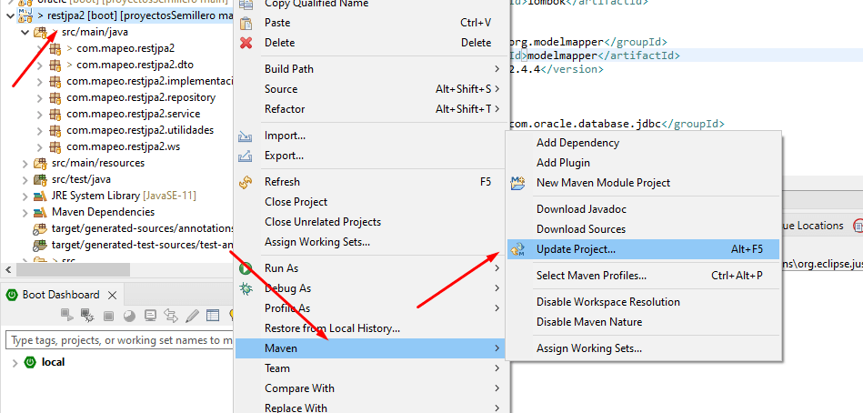
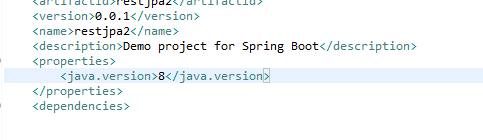
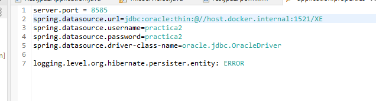
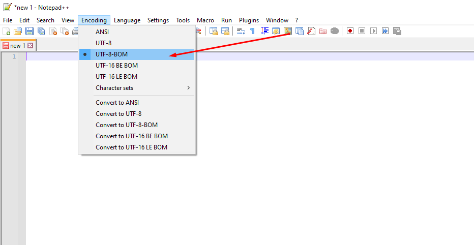

# SEMILLERO SEGUROS UNIVERSALES

## restjpa2

restjpa2 es un servidor de datos que trabaja sobre una instancia de Oracle XE instalada localmente y configurada con el usuario y contraseña  **practica2**

El sistema implementa un mapeo de datos, para un modelo relacional creado para administrar la información de una empresa de seguros. 

restjpa2 posee un CRUD para las diferentes entidades en la base de datos física, este fue implementado usando JPA de spring para crear el mapeo de entidades y repositoris, pero también se crearon implementaciones de Querys nativas (sentencias sql), para realizar ciertas transacciones. Tambié se implementan llamadas a funciones y procedimientos almacenados. 

Por ultimo, el proyecto fue configurado para su despliegue en docker. 

**NOTA:**  La base de datos debe de estar local. 

## Versiones (Actual)
* 1.0.0

## Entorno de desarrollo
- Java 16 ( o apartir de la version 8)
- Spring Boot      
    - SpringToolSuit4
- [Oracle XE](https://www.oracle.com/database/technologies/xe-downloads.html) 21c      
    - Instalar Oracle SQL Developer       
    - Instalar Developer Data Modeler


## Configuraciones de servidor 

<details> <summary> Properties (+) </summary>
<p>

```
server.port = 8585   
spring.datasource.url=jdbc:oracle:thin:@//host.docker.internal:1521/XE
spring.datasource.username=practica2 
spring.datasource.password=practica2 
spring.datasource.driver-class-name=oracle.jdbc.OracleDriver

logging.level.org.hibernate.persister.entity: ERROR
```

</p>
</details>

<details> <summary> Dependencias (+) </summary>
<p>

### JPA

```
<dependency>
	<groupId>org.springframework.boot</groupId>
	<artifactId>spring-boot-starter-data-jpa</artifactId>
</dependency>
```

### SPRING WEB

```
<dependency>
	<groupId>org.springframework.boot</groupId>
	<artifactId>spring-boot-starter-web</artifactId>
</dependency>
		
```

### Oracle

```
<dependency>
	<groupId>com.oracle.database.jdbc</groupId>
	<artifactId>ojdbc8</artifactId>
	<scope>runtime</scope>
</dependency>

```


### Model Mapper

```
<dependency>
    <groupId>org.modelmapper</groupId>
    <artifactId>modelmapper</artifactId>
    <version>2.4.4</version>                     
</dependency>

```


### LOMBOK

```
<dependency>
    <groupId>org.projectlombok</groupId>
    <artifactId>lombok</artifactId>
</dependency>
```

<details> <summary> Configurano Lombok (+) </summary>
<p>
Luego de agregar esto 



Es necesario especificar la ruta del sts.exe (sprint tool suit)


Si no se reconoce automaticamente, se debera especificar manualmente la ruta y luego darle en install/update


Si aun existen errores de referencias no encontradas, damos click derecho sobre el proyecto > maven > Update Project...


</p>
</details>


</p>
</details>


##    


# MAVEN - COMPILAR JAR 

Primero cambiar de la version 11 a la 8


Segundo, cambiar la concexión de la base de datos. 






mvn clean install package


docker build -t testservice .
docker run -p 8585:8585 testservice

<----DOCKER FILE---->FROM openjdk:8-jdk-alpine

VOLUME /tmp

COPY target/oracle-2.0.0.jar app.jar

ENTRYPOINT ["java","-jar","/app.jar"]

Comando para ver LOGS:

docker logs --tail 1000 -f <nombre_contenedor>


docker build -t servicio-companero
docker run -p 8585:8585 servicio-companero --name container-companero

